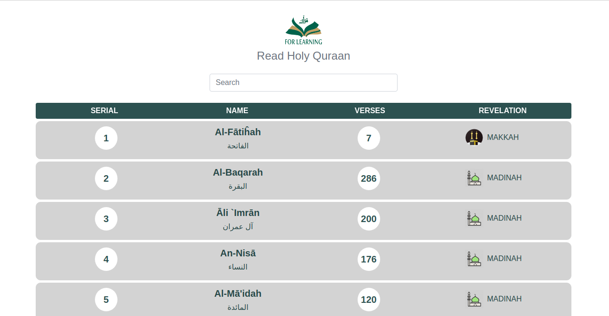

This project was bootstrapped with [Create React App](https://github.com/facebook/create-react-app).

## Link for the Application here..
### `https://al-quraan-app.web.app`
or,
### `al-quraan-app.firebaseapp.com`

## App Screenshots..
  

## Description.
  `The program is coded with React & Firebase. I created this application to read real-life Quran with real feel on Quran Pages. Data is managed with React-Redux and added Firebase Realtime Database to data storing. Redux helped a lot. I'm used Redux library to keep data flow with separate components & dispatching any-kinds of data flow(like with search engines data queries). Meybe, peoples will be happy for this read mode on Al-Quran pages. Also I could use the Real REST_API, but I don't. Used Firebase for easy querieing data and fetching data from database. So, Feel free to use and Read Holy Quran at-least one time on a day.`
  
## Features.
  1. Al-Quran Read Mode switcher on Pages.
  2. React-Scrolling system on multiple Quran Pages.
  3. Powerfull & RealTime search engine to search any surah's on Quran.
